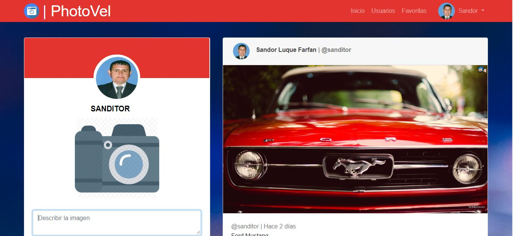
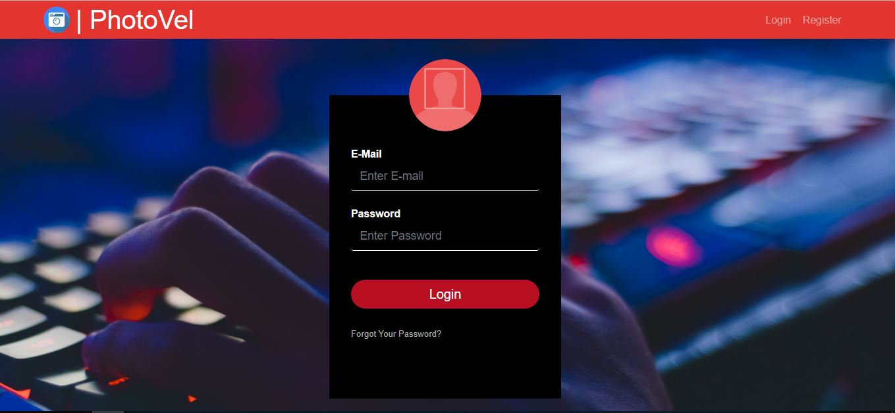
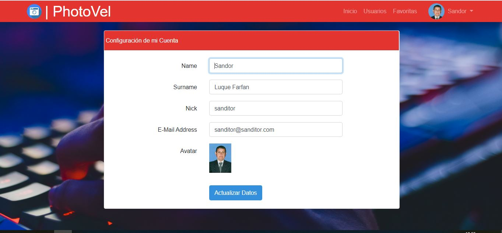
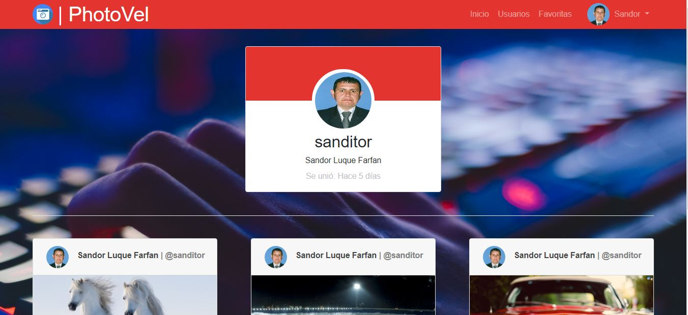
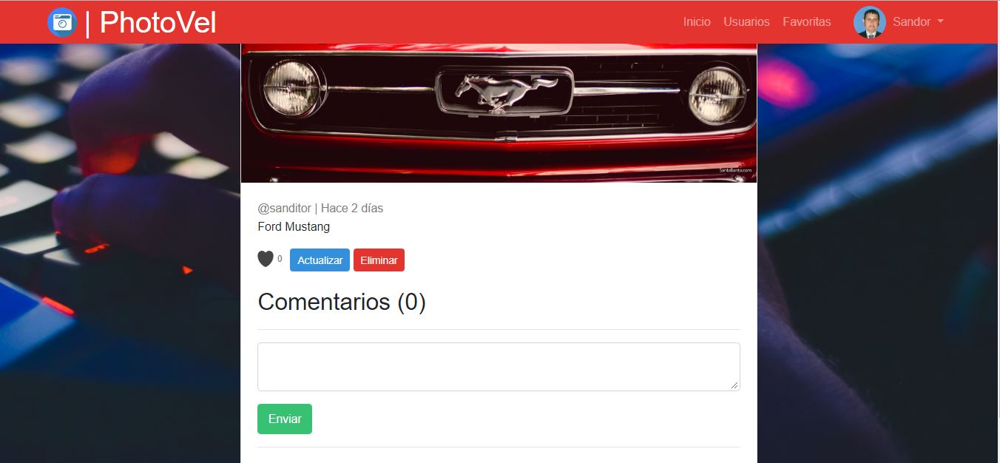
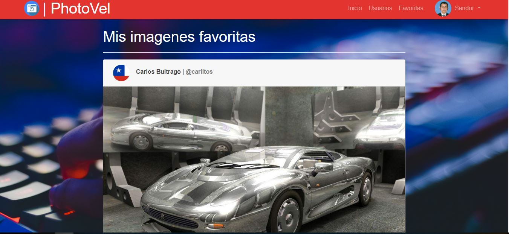

<h1 align="center">PhotoVel</h1>

## Esta aplicacion es una red social similar a instagram Esta programada con Laravel 5.6. 

##Instrucciones

1. Clonar el repositorio en la carpeta www(wampserver), httdocs(xampp).
2. Ejecutar la sentencia sql(database.sql) que esta dentro de la carpeta de la raiz del proyecto llamada BBDD en php admin de msql.
3. Instalar composer (https://getcomposer.org/)
4. Abrir la consola de windows, linux o la de su preferencia en la carpeta del proyecto descargado en el punto 1.
5. Teclear: php artisan serve. Para ejecutar el proyecto.
6. Abir el navegador de su preferencia y teclear en la url: localhost:8000
7. Crear un usuario y subir fotos, editar, comentar, dar likes, cambiar la preferencias, entre otras funcionalidades

<h3 align="center">Capturas del Aplicativo</h3>

## Previews

      
      
      
      
      
      

 

## Contributing

Thank you for considering contributing to the Laravel framework! The contribution guide can be found in the [Laravel documentation](https://laravel.com/docs/contributions).

## Security Vulnerabilities

If you discover a security vulnerability within Laravel, please send an e-mail to Taylor Otwell via [taylor@laravel.com](mailto:taylor@laravel.com). All security vulnerabilities will be promptly addressed.

## License

The Laravel framework is open-sourced software licensed under the [MIT license](https://opensource.org/licenses/MIT).
